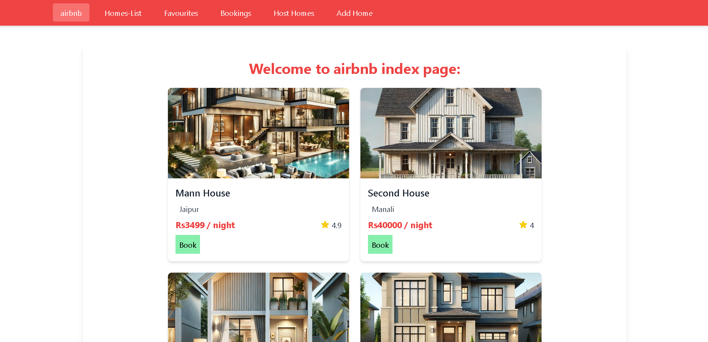
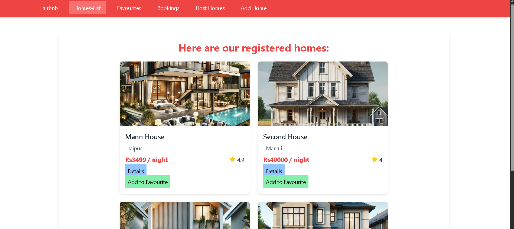
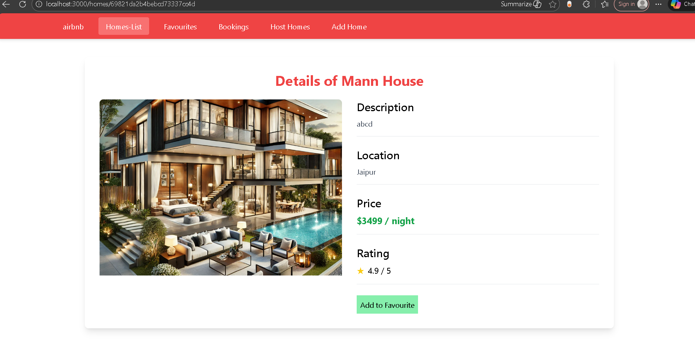
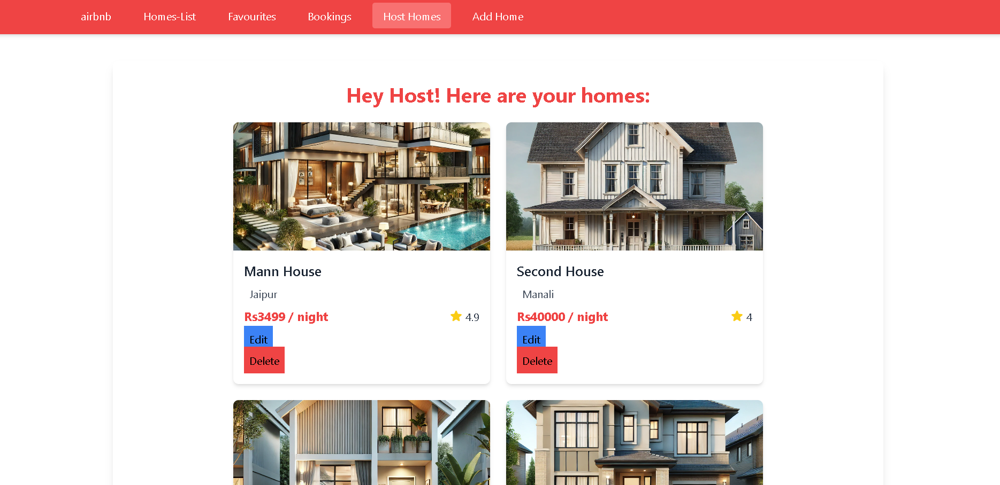
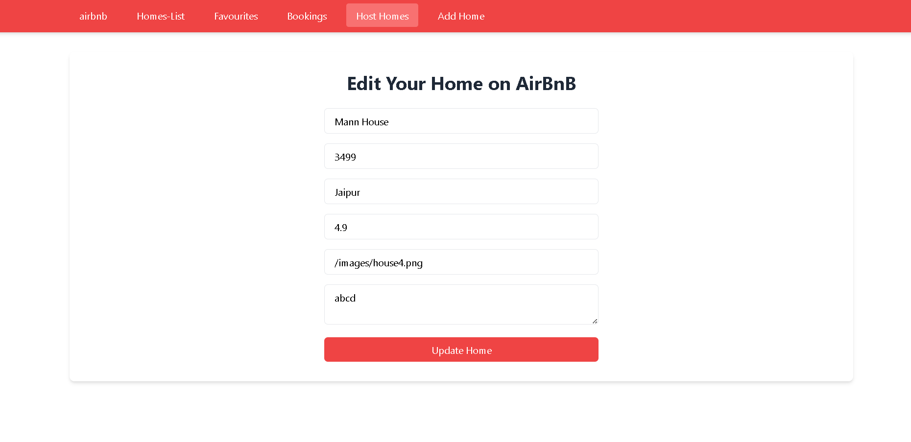
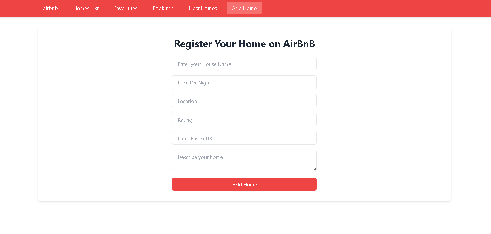
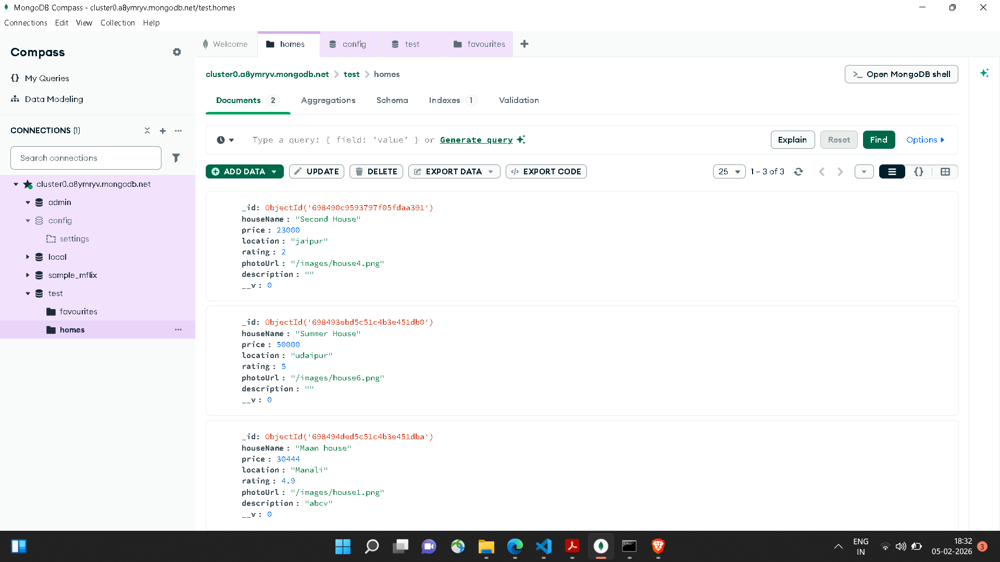
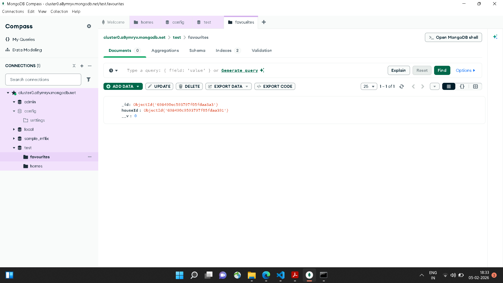

# Airbnb Clone

A full-stack Airbnb-inspired web application built using Express, EJS, and MongoDB. Users can browse property listings, view details, and hosts can manage their property listings.

## Demo Screenshots

## Demo Video

https://drive.google.com/file/d/1fsa4McDmfcuU9JaXadiyqoftAqVkN9Nn/view?usp=sharing

## Features

### 🏪 Store (User Side)

- View all available property listings
- View detailed page of each property
- Add properties to favourites
- Responsive UI using Tailwind CSS
- Custom 404 error page

### 🏠 Host (Admin/Owner Side)

- Add new property listings
- Edit existing listings
- Delete property listings
- Manage hosted properties

## Tech Stack

Backend:

- Node.js
- Express.js
- Frontend:

- EJS (Templating Engine)
- HTML
- Tailwind CSS

Database:

- MongoDB

Development Tool:

- Nodemon

## Installation & Setup

### 1️⃣ Clone the repository

git clone https://github.com/dyutia/Airbnb.git

### 2️⃣ Navigate into project folder

cd Airbnb

### 3️⃣ Install dependencies

npm install

### 4️⃣ Create .env file

MONGO_URI=your_mongodb_atlas_connection_string
PORT=3000

### 5️⃣ Start the server

npx nodemon app.js

OR

npm start

The application will run on:
http://localhost:3000

## Future Improvements

- Complete booking system
- Reservation availability logic
- Authentication system
- Payment integration
